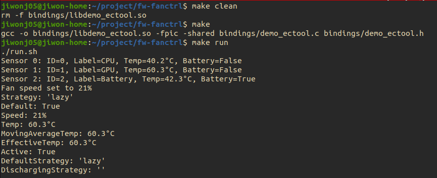

# Native Fan Control Integration (GSoC Qualification Task)

This repository is based on the open-source project [**fw-fanctrl**](https://github.com/TamtamHero/fw-fanctrl) and was created as part of a **Google Summer of Code (GSoC)** qualification task.

---

## GSoC Qualification Task Description

> **Goal:**  
> A proof of concept - create a basic dummy library that returns a constant value to Python (for any of the functions), and integrate it into fw-fanctrl.

---

## What I Did

- Created a C shared library (`libdemo_ectool.so`) that returns constant mock data:
  - Fake temperature readings
  - Static fan status
  - Power state (AC)
-  Defined a `sensor` struct in C with fields like `id`, `label`, `temperature`, and `is_battery`
- Created Python bindings for the library using `ctypes` in `demo_binding.py`
- Replaced the original `ectool` subprocess-based logic in `EctoolHardwareController` with calls to my native library
- Updated the project structure, Makefile, and environment setup for clean integration

---

## How to Build & Run

```bash
# Compile the C library and move it into place
make install

# Set up PYTHONPATH and run the project
make run

Sensor 0: ID=0, Label=CPU, Temp=40.2°C, Battery=False
Sensor 1: ID=1, Label=GPU, Temp=60.3°C, Battery=False
Sensor 2: ID=2, Label=Battery, Temp=42.3°C, Battery=True
Fan speed set to 21%

```
---

## Screenshot

Below is how it looks when running `make run`, which launches `fw-fanctrl run` with the native C library integration:



## What I Learned

- How to write and compile C shared libraries (`.so`)
- Using `ctypes` to bind native C functions into Python
- How to restructure a Python project to use native code instead of subprocesses
- Real-world integration practices with existing open source code
- Clean Python/C interface design for hardware simulation

---

## 📘 Credits

This project is **based on**:  
🔗 [TamtamHero/fw-fanctrl](https://github.com/TamtamHero/fw-fanctrl)

---

## 📄 License

This project is licensed under the [MIT License](./LICENSE), inherited from the original [fw-fanctrl](https://github.com/TamtamHero/fw-fanctrl) project.

